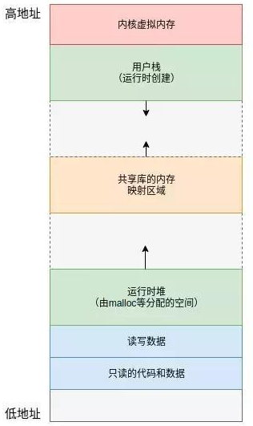

## C语言函数调用栈
函数调用是通过栈来实现的，在栈中存放着该函数的局部变量。但是对于栈的实现细节可能不一定清楚。
本文将介绍一下在Windows平台下函数栈是如何实现的（Linux平台的基本思想类似，细节可能有些不同）。了解系统深层次的原理对分析疑难问题有很好的帮助。

在X64体系中函数的参数是通过寄存器传递的。如图1是X86 CPU寄存器的列表及功能简要说明
操作系统通过虚拟内存的方式为所有应用程序提供了统一的内存映射地址。如图3所示，从上到下分别是用户栈、共享库内存、运行时堆和代码段。当然这个是一个大概的分段，实际分段比这个可能稍微复杂一些，但整个格局没有大变化。



汇编程序中函数调用的实现。函数的调用主要分为2部分，一个是调用，另外一个是返回。在汇编语言中函数调用是通过call指令完成的，返回则是通过ret指令。

汇编语言的call指令相当于执行了2步操作，分别是，1）将当前的IP或CS和IP压入栈中； 2）跳转，类似与jmp指令。同样，ret指令也分2步，分别是，1）将栈中的地址弹出到IP寄存器；2）跳转执行后续指令。这个基本上就是函数调用的原理。

除了在代码间的跳动外，函数的调用往往还需要传递一个参数，而处理完成后还可能有返回值。这些数据的传递都是通过寄存器进行的。在函数调用之前通过上文介绍的寄存器存储参数，函数返回之前通过RAX寄存器（32位系统为EAX）存储返回结果。

另外一个比较重要的知识点是函数调用过程中与堆栈相关的寄存器RSP和RBP，两个寄存器主要实现对栈位置的记录，具体作用如下：

RSP：栈指针寄存器(reextended stack pointer)，其内存放着一个指针，该指针永远指向系统栈最上面一个栈帧的栈顶。

RBP：基址指针寄存器(reextended base pointer)，其内存放着一个指针，该指针永远指向系统栈最上面一个栈帧的底部。

寄存器的名称跟体系结构是相关的，本文是64位系统，因此寄存器是RSP和RBP。如果是32位系统则寄存器的名称为ESP和EBP。

应用程序调用栈

我们先从整体上来看一下函数调用栈的主要内容，如图所示。在函数栈中主要包括函数参数表、局部变量表、栈的基址和函数返回地址。这里栈的基址是上一个栈帧的基址，因为在本函数中需要使用该基址访问栈中的内容，因此需要首先将上一个栈帧中的基址压栈。

实际生产环境中与栈相关的问题也是比较多的，比如局部变量太多导致的栈溢出，或者踩内存问题引起的栈破坏等等。

### 寄存器列表
- 通用寄存器(32bit)
通用寄存器是程序执行代码最最常用，也最最基础的寄存器，程序执行过程中，绝大部分时间都是在操作这些寄存器来实现指令功能。
    - eax：通常用来执行加法，函数调用的返回值一般也放在这里面
    - ebx：数据存取
    - ecx：通常用作计数器，比如for循环
    - edx：暂不清楚
    - esp：栈顶指针，指向栈的顶部
    - ebp：栈底指针，指向栈的底部，通常用ebp+偏移量的形式来定位函数存放在栈中的局部变量
    - edi：字符串操作时，用于存放数据源的地址
    - esi：字符串操作时，用于存放目的地址的，和edi两个经常搭配一起使用，执行字符串的复制等操作

- 通用寄存器x86_64架构(64bit)
    - rax：通常用于存储函数调用返回值
    - rsp：栈顶指针，指向栈的顶部
    - rdi：第一个入参
    - rsi：第二个入参
    - rdx：第三个入参
    - rcx：第四个入参
    - r8：第五个入参
    - r9：第六个入参
    - rbx：数据存储，遵循Callee Save原则
    - rbp：数据存储，遵循Callee Save原则
    - r12~r15：数据存储，遵循Callee Save原则
    - r10~r11：数据存储，遵循Caller Save原则
Callee Save：函数调用时，父函数无需保存这些寄存器值，可以直接调用子函数，子函数使用这些寄存器之前，需要保存这些寄存器值，即这些寄存器的值是由被调用者来保存和恢复。
Caller Save：函数调用时，父函数需要压栈保存这些寄存器值，I子函数可随意使用这些寄存器。

### 反汇编
我们在学习C语言的时候经常需要把C代码反汇编成汇编代码，通过汇编代码查看代码是怎么运行的，函数形参、局部变量是怎么压栈，函数是怎么调用的，栈指针是怎么跳转工作等等。
`gcc -S main.c -o main.s`

### 实例说明：
本实例基于windows 10 64位操作系统，编译器为`mingw64`

```
void func_call_demo2()
{
    return;
}

int func_call_demo(int a, int b, int c, int d)
{
    // 参数先从寄存器入栈
    int e, f;
    long long g;
    e = 1;// movl	$1, -4(%rbp)
    f = 2;// movl	$2, -8(%rbp)
    g = 3;// movq	$3, -16(%rbp)
    func_call_demo2();
    e = a + b + c +d;
    return e;
}

int main()
{
    int f = 0;//movl	$0, -4(%rbp)
    int g = 1;//movl	$1, -8(%rbp)
    f = func_call_demo(1,2,3,4+g);
    printf("value: %d\n", f);
    return 0;
}
```

```
func_call_demo:
	pushq	%rbp #rbp压入函数栈中，原函数的rbp保存，后续函数返回时pop出来
	.seh_pushreg	%rbp
	movq	%rsp, %rbp #更新rbp的值，构建本函数的栈帧头，后面对本栈帧的内容的访问都是通过帧头（RBP）进行的
	.seh_setframe	%rbp, 0
	subq	$48, %rsp
	.seh_stackalloc	48
	.seh_endprologue
	movl	%ecx, 16(%rbp)//将参数从寄存器搬到栈
	movl	%edx, 24(%rbp)//将参数从寄存器搬到栈
	movl	%r8d, 32(%rbp)//将参数从寄存器搬到栈
	movl	%r9d, 40(%rbp)//将参数从寄存器搬到栈
	movl	$1, -4(%rbp)
	movl	$2, -8(%rbp)
	movq	$3, -16(%rbp)
	call	func_call_demo2
	movl	16(%rbp), %edx
	movl	24(%rbp), %eax
	addl	%eax, %edx
	movl	32(%rbp), %eax
	addl	%eax, %edx
	movl	40(%rbp), %eax
	addl	%edx, %eax
	movl	%eax, -4(%rbp)
	movl	-4(%rbp), %eax
	addq	$48, %rsp
	popq	%rbp
	ret
	.seh_endproc
	.def	__main;	.scl	2;	.type	32;	.endef
	.section .rdata,"dr"
.LC0:
	.ascii "value: %d\12\0"
	.text
	.globl	main
	.def	main;	.scl	2;	.type	32;	.endef
	.seh_proc	main
main:
	pushq	%rbp
	.seh_pushreg	%rbp
	movq	%rsp, %rbp
	.seh_setframe	%rbp, 0
	subq	$48, %rsp
	.seh_stackalloc	48
	.seh_endprologue
	call	__main
	movl	$0, -4(%rbp) //rbp base pointer,指向当前函数栈的基地址，栈从高位到地位
	movl	$1, -8(%rbp) //第二个变量赋值
	movl	-8(%rbp), %eax //变量g放入寄存器
	addl	$4, %eax //实现4+g的运算
	movl	%eax, %r9d //将运算的结果放入r9d寄存器
	movl	$3, %r8d //将3放入r9d寄存器
	movl	$2, %edx //将2放入edx寄存器
	movl	$1, %ecx //将1放入ecx寄存器
	call	func_call_demo//函数调用，当前rbp会在调用函数里入栈保存，在函数调用结束后出栈恢复
	movl	%eax, -4(%rbp)
	movl	-4(%rbp), %eax
	movl	%eax, %edx
	leaq	.LC0(%rip), %rax
	movq	%rax, %rcx
	call	printf
	movl	$0, %eax
	addq	$48, %rsp
	popq	%rbp
	ret
	.seh_endproc
	.ident	"GCC: (x86_64-posix-seh-rev0, Built by MinGW-W64 project) 12.2.0"
	.def	__mingw_vfprintf;	.scl	2;	.type	32;	.endef
```
### Reference
- [gcc反汇编方法](https://www.bilibili.com/read/cv13394481)
- [x86/x64架构寄存器](https://zhuanlan.zhihu.com/p/502718676)